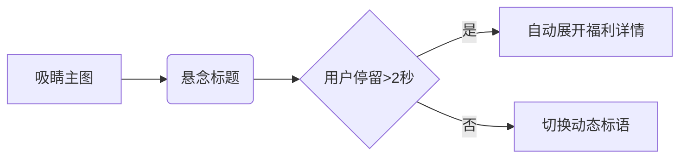
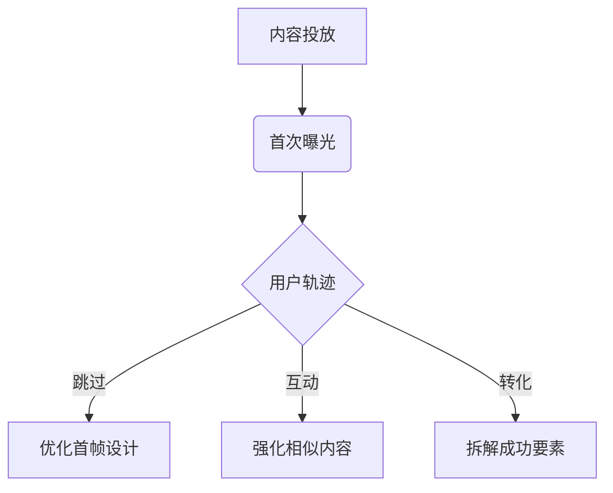

# Facebook广告内容分层运营策略

## 一、用户生命周期三维内容模型
基于不同阶段的用户认知特点，构建分层内容体系已成为提升广告效率的核心方法论。将用户划分为认知层（Cold Audience）、兴趣层（Warm Audience）、忠诚层（Hot Audience）三个层级，需匹配差异化的内容组合策略。

### 1. 冷启动核心要素
- **闪电记忆符号**：在信息流广告前3秒设置视觉锚点（如霓虹数字框+动态箭头指示）
- **悬念制造机制**：视频广告采用"问题前置"结构（"98%用户不知道的护肤误区→"）
- **即时价值载体**：轮播广告第一张图嵌入倒计时模块（限时福利倒计72小时）

### 2. 三阶段版位组合矩阵
| 用户层级 | 主力版位 | 辅助版位 | 禁用版位 |
|----------|----------|----------|---------|
| 认知层 | Instagram动态 | 右边栏 | 插播广告 |
| 兴趣层 | 快拍广告 | 信息流 | Marketplace |
| 忠诚层 | Messenger | 搜索结果 | 轮播广告 |

## 二、认知层穿透式内容架构
针对尚未接触品牌的Cold Audience，需在1.8秒内完成用户注意捕获。

### 1. 视觉定帧技术
- 采用1080×1080像素的主视觉图，遵循"4元素法则"：
  - 产品实体（占比58%画面）
  - 价值符号（如"$"或"%折扣"）
  - 行动指引（悬浮按钮设计）
  - 信任背书（微型认证标识）

### 2. 信息流穿越组合


## 三、兴趣层深度培育方案
对已产生行为痕迹的Warm Audience，重点在于构建连续内容触点。

### 1. 动态剧情广告序列
- **Day1**：痛点揭示型视频（5-15秒）
- **Day3**：解决方案轮播图（3-5张）
- **Day5**：用户证言合集视频
- **Day7**：限时独家优惠通知

### 2. 快拍广告互动公式
`观看时长 × 点击热区 = 深度交互值`
- 在9:16竖版视频中设置3个点击热区：
  - 第5秒：可滑动的产品对比模块
  - 第8秒：实时投票选择器
  - 结尾处：AR试妆/试戴入口

## 四、忠诚层裂变加速器
针对Hot Audience的广告需突破单纯促销，构建情感联结。

### 1. 社交关系链植入
- **会员专属广告**：在Messenger广告中嵌入VIP识别码
- **裂变加速器**：设置"邀请好友得双倍积分"交互模块
- **私域沉淀入口**：轮播广告末帧展示客服二维码

### 2. 场景化触发机制
| 用户行为 | 触发内容 | 送达延迟 |
|----------|---------|---------|
| 加购未支付 | 库存预警通知 | ≤30分钟 |
| 浏览产品页 | 搭配建议广告 | 2小时后 |
| 复购周期到时 | 定制礼盒推送 | 精准定时 |

## 五、自动化版位调优系统
基于Facebook智能版位功能，构建动态分发的广告生态。

### 1. 权重分配算法
`版位效能值 = (CTR × 0.4) + (CVR × 0.6) - 疲劳系数`
- 每6小时重新计算各版位权重
- 当效能值差异>15%时触发重新分配

### 2. 三阶疲劳管理系统
| 疲劳指数 | 应对策略 | 恢复周期 |
|----------|---------|---------|
| 30-50   | 更换背景色系 | 12小时 |
| 50-70   | 重组素材元素 | 24小时 |
| >70     | 启用备用创意 | 立即生效 |

## 六、广告资产沉淀策略
建立可复用的内容组件库，实现持续价值输出。

### 1. 模块化素材库
- **基础组件**：规范品牌色值、字体库、人物素材
- **智能模板**：适配各版位的108套尺寸模板
- **数据看板**：实时标注素材生命周期曲线

### 2. 效果追溯图谱


---

通过构建用户生命周期的内容进阶体系，广告主可实现从流量获取到关系深耕的转化跃迁。在30亿月活的生态中，精细化分层运营不仅提高单个广告的ROI，更建立起持续生长的品牌资产库。关键在于将广告内容从孤立的推广信息，进化为与用户深度对话的交流体系，最终形成"广告即服务"的新生态模式。```
